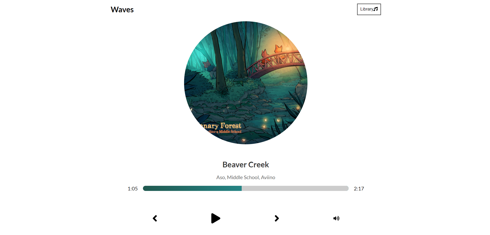
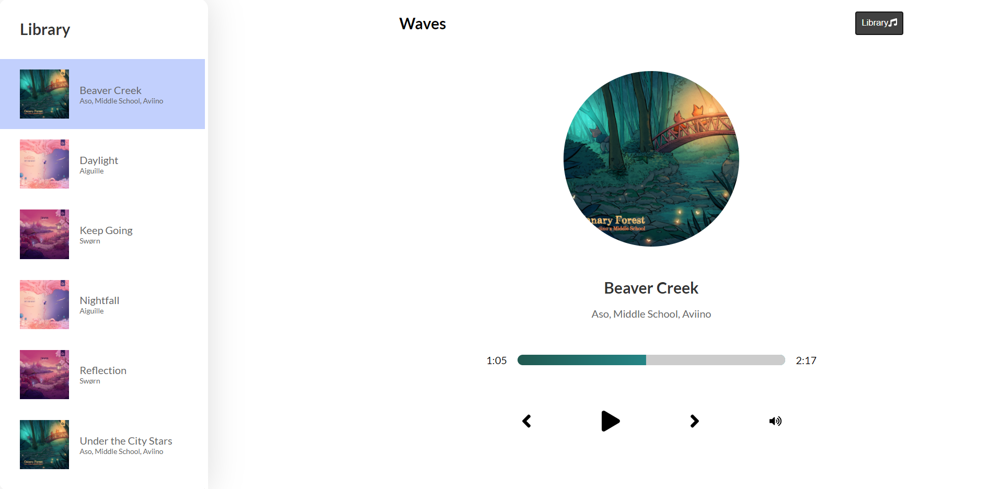
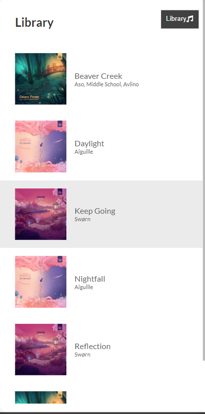
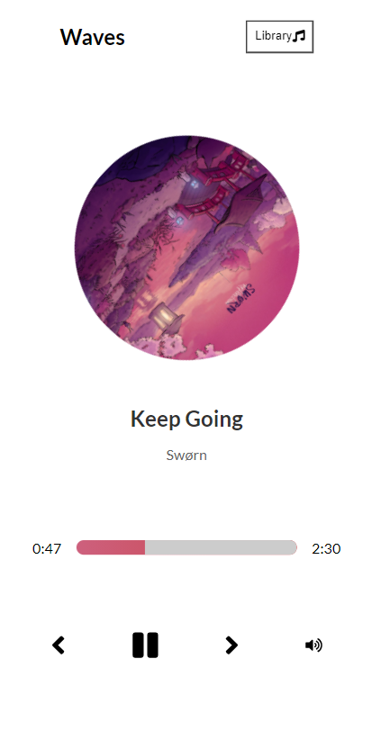

This project is running at [React Music Player](https://react-lofi.netlify.app/).

## Tech Stack Used :

In this project, we have used:

### `React` with `HTML` `Sass` and `JavaScript`

The project is built with basic ReactJS along with HTML, Sass and JavaScript. 
You can read the [React Documentation](https://reactjs.org/) to learn more about this JavaScript Library.

##Screenshots :

